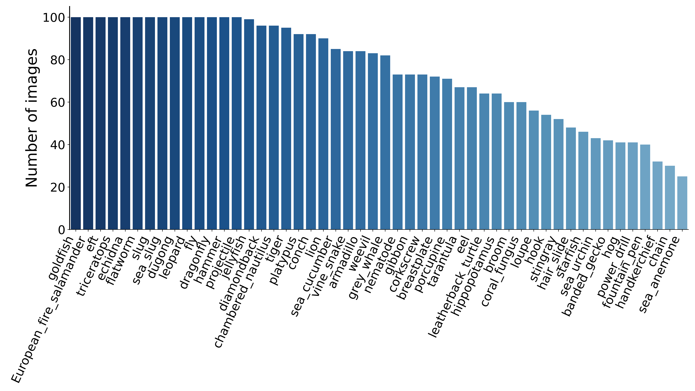

# False Positive Assessment for COCO Detectors: A Dataset and Benchmark


## Data download

Our data is stored in Google Drive, please download it [here](https://drive.google.com/drive/folders/1rPXeElNS36UwhIqBPghS6-BLyGWbbe1E?usp=drive_link).

Consistent with the original COCO validation set, the data is organized as follows:

```
 └── COCO-FP
        ├── Val2017
        │    ├── 000000397133.jpg
        │    ├── ...
        │    └── n01443537_138_n01443537.JPEG
        │   
        └── annotations
             └── instances_val2017.json
```

The proposed COCO-FP consists of 8,772 images. Among them, 5,000 images are from COCO Val, and 3,772 images(50 categories) are from ImageNet. For images from ImageNet, we keep their original image naming format, e.g., `n01443537_138_n01443537.JPEG`.
